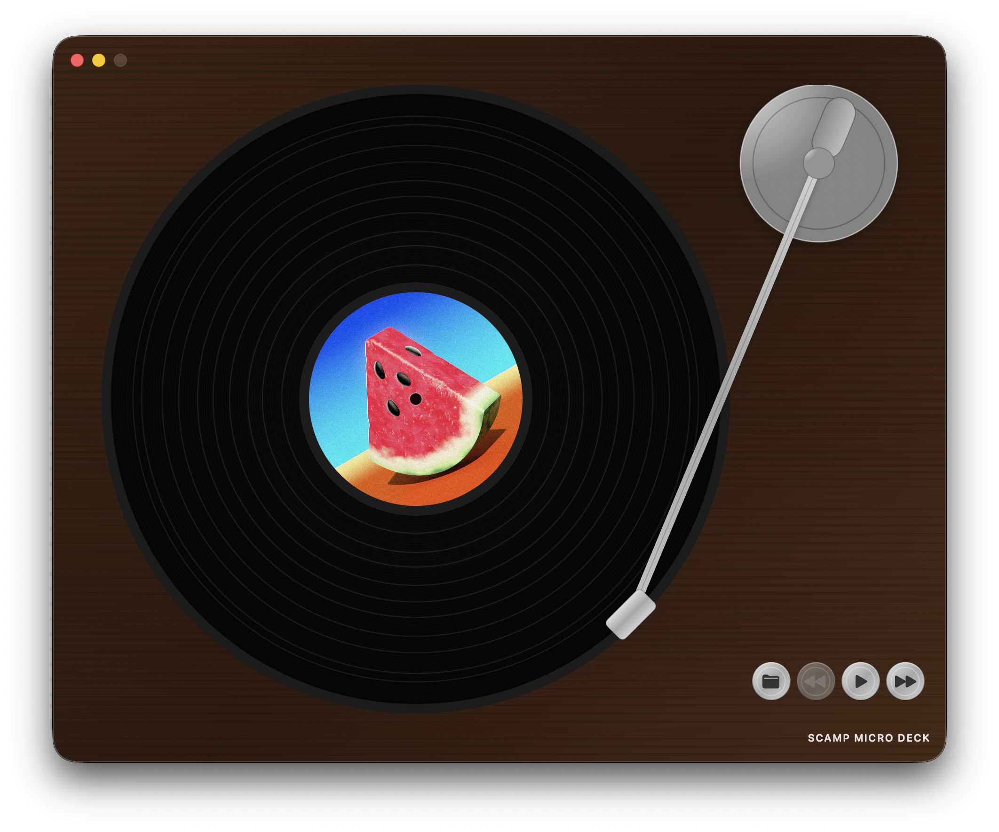

# Scamp

Scamp is a native macOS music player with a vinyl-deck vibe.
Load a folder of local tracks, hit play, and watch the record spin while the
tonearm follows along. Built with SwiftUI + AVFoundation, and intentionally
small, fast, and focused.

<p>
  
</p>

## Install (Unsigned Build)

1. Download the latest release from the **Releases** panel on the right.
2. Unzip it and double-click `Scamp.app`.
3. macOS will say Scamp cannot be opened.
4. Open **System Settings** > **Privacy & Security** > **Security**.
5. Click **Open Anyway** for Scamp.
6. Open Scamp again.

## Record Folder Format

- Keep songs in alphabetical order by filename.
- Include exactly 1 cover image named `cover.jpg`.

## Development

```bash
mise start
```
